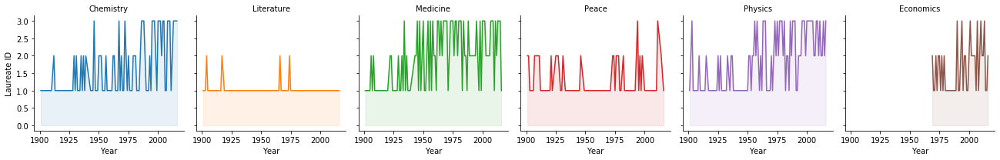
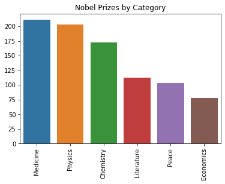
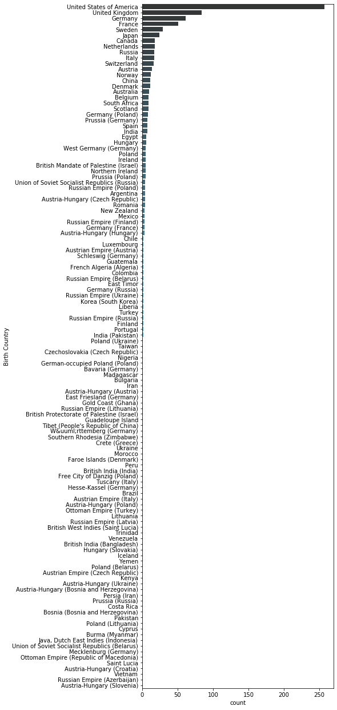
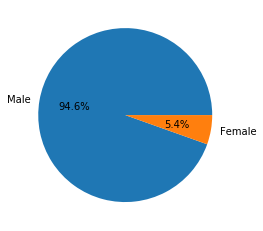
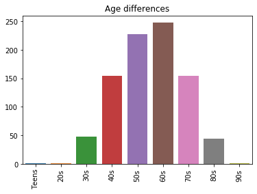
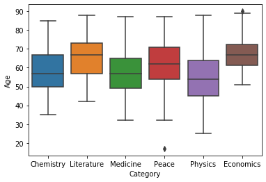
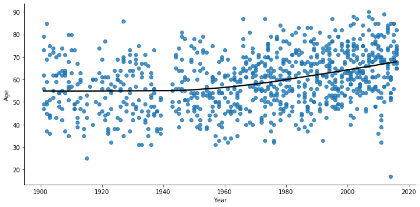

### [Link_To_Page](https://perymkamal.github.io/DataEngineeringProject_DataPirates/)

### [Presentation](https://docs.google.com/presentation/d/1jOM2AgLenzFTCzW-_EEtfIyIFpKB8hE4QoYsgLXZyIs/edit?usp=sharing)
### [Repositry](https://github.com/PeryMKamal/DataEngineeringProject_DataPirates)

# Overview
###### The Nobel Prize is perhaps the world's most well known scientific award. Every year it is given to scientists and scholars in chemistry, literature, physics, medicine, economics, and peace. The first Nobel Prize was handed out in 1901, and at that time the prize was Eurocentric and male-focused, but nowadays it's not biased in any way. Surely, right? Well, we’re going to find out! The Nobel Foundation has made a dataset available of all prize winners from the start of the prize, in 1901, to 2016. Let’s load it in and check it out.

## Exploratory Questions

### How many nobel prizes we have between 1901 and 2016
   

### How many male nobel prizes and how many female nobel prizes

### What are the different nationalities winning the nobel prize

### What is the proption of female lauretes per decade

### What is the proption of female lauretes per category

### Who is the first woman to win the Nobel Prize

### Who won the nobel prize more than once?

## Number of Nobel Prizes in each category

## Visualization of number of prizes in each country in every category, USA dominance

## Pie chart for the whole dataframe gender, which gender is most likely to win a nobel prize?

## Age differences between the whole nobel prize categories

   

## Distribution of Age of Winners in each Category using boxplot

## How old are you when you get the prize?

